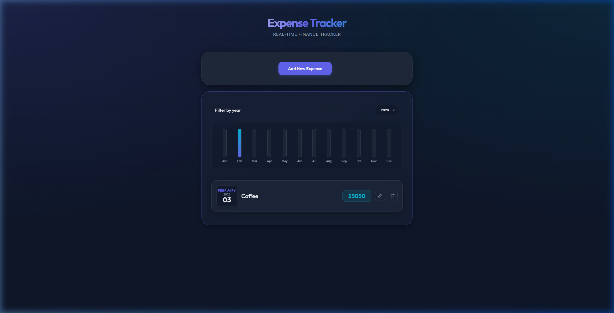

# 💰 Expense Tracker - Premium Finance Manager

A modern full-stack expense tracking application to manage, analyze, and visualize your personal finances. Built with a sleek dark-themed UI and powered by a scalable backend.

---

## 🔗 Live Demo

👉 https://expensetrackercool.netlify.app/

---

## ✨ Features

- 📊 **Dynamic Monthly Chart** – Visualize your spending patterns with interactive charts
- 📅 **Yearly Filtering** – Track expenses across different years
- ➕ **Easy Expense Entry** – Add expenses with title, amount, and date
- 💾 **Persistent Storage** – Data stored securely using MongoDB
- ⚡ **Fast & Responsive UI** – Built with React for smooth performance
- 🌙 **Premium Dark Theme** – Modern UI with clean design aesthetics

---

## 🛠️ Tech Stack

- **Frontend:** React
- **Backend:** Node.js, Express
- **Database:** MongoDB (Mongoose)
- **Styling:** CSS3
